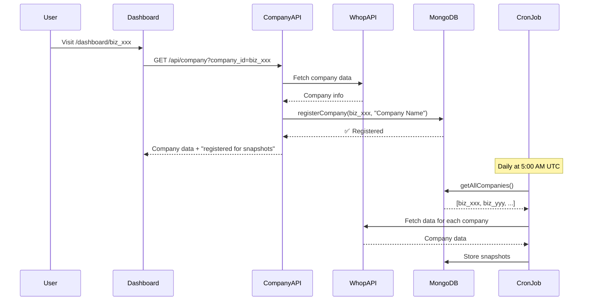

# Auto-Registration System

## Overview

Companies are **automatically registered** for snapshot capture when a user first visits their dashboard. No manual configuration needed!

## How It Works

### 1. User Visits Dashboard

When a user navigates to `/dashboard/biz_xxxxxxxxxxxxx`:

1. Sidebar loads company info via `/api/company?company_id=biz_xxx`
2. API fetches company data from Whop
3. **Company is automatically registered** in MongoDB `companies` collection
4. Company ID and name are stored for future snapshots

```
User visits dashboard
  ↓
Sidebar fetches company info
  ↓
Company API auto-registers in MongoDB
  ↓
✅ Company ready for snapshots!
```

### 2. Daily Snapshots

The cron job automatically finds all registered companies:

```javascript
// lib/services/snapshotService.ts
async function captureAllSnapshots() {
  // Get ALL registered companies from database
  const companies = await companyRepository.getAllCompanies()

  // Capture snapshot for each one
  for (const company of companies) {
    await captureCompanySnapshot(company.whopCompanyId)
  }
}
```

## Benefits

### ✅ No Manual Configuration
- No `COMPANY_IDS` environment variable needed
- No manual company registration required
- Works automatically for all users

### ✅ Multi-Tenant Ready
- Each company is tracked independently
- Snapshots captured for all visited companies
- Scales automatically as users are added

### ✅ Self-Service
- Users don't need admin intervention
- Companies register on first visit
- Immediate snapshot support

## MongoDB Collections

### `companies` Collection

Stores registered companies:

```javascript
{
  _id: ObjectId("..."),
  whopCompanyId: "biz_xxxxxxxxxxxxx",
  companyName: "Acme Corp",
  createdAt: ISODate("2025-10-11T..."),
  updatedAt: ISODate("2025-10-11T..."),
  lastSyncAt: ISODate("2025-10-11T05:00:00Z"),
  settings: {
    defaultCurrency: "USD",
    timezone: "America/New_York"
  }
}
```

### `metrics_snapshots` Collection

Stores daily snapshots for each company:

```javascript
{
  _id: ObjectId("..."),
  companyId: "biz_xxxxxxxxxxxxx",  // Links to companies collection
  date: ISODate("2025-10-11T00:00:00Z"),
  timestamp: ISODate("2025-10-11T05:00:15Z"),
  mrr: { ... },
  arr: 149400,
  rawData: {
    company: { ... },
    memberships: [ ... ],
    plans: [ ... ],
    transactions: [ ... ]
  }
}
```

## Registration Flow



## API Reference

### Auto-Registration Endpoint

**GET** `/api/company?company_id=biz_xxx`

Fetches company info and auto-registers for snapshots.

**Response:**
```json
{
  "id": "biz_xxxxxxxxxxxxx",
  "title": "Acme Corp",
  "logo": "https://...",
  "bannerImage": "https://...",
  "cached": false
}
```

**Side Effect:**
- Company is registered in `companies` collection
- Will be included in next snapshot cycle

### Check Registered Companies

```javascript
// View all registered companies in MongoDB
db.companies.find({}, {
  whopCompanyId: 1,
  companyName: 1,
  lastSyncAt: 1
})
```

### Manual Registration (if needed)

If you need to pre-register companies without visiting dashboards:

```javascript
// Using MongoDB shell or app code
await companyRepository.registerCompany(
  "biz_xxxxxxxxxxxxx",
  "Company Name"
)
```

## Environment Variables

**Before (Manual):**
```env
COMPANY_IDS=biz_xxx,biz_yyy,biz_zzz  # ❌ Manual list
```

**After (Automatic):**
```env
# No COMPANY_IDS needed! ✅
# Companies auto-register from dashboard visits
```

## Testing

### 1. Visit a Dashboard

Navigate to: `https://your-app.vercel.app/dashboard/biz_xxxxxxxxxxxxx`

**Expected Console Logs:**
```
✅ Company biz_xxxxxxxxxxxxx (Acme Corp) registered for snapshots
```

### 2. Check MongoDB

```javascript
db.companies.findOne({ whopCompanyId: "biz_xxxxxxxxxxxxx" })
```

Should return:
```javascript
{
  _id: ObjectId("..."),
  whopCompanyId: "biz_xxxxxxxxxxxxx",
  companyName: "Acme Corp",
  createdAt: ISODate("..."),
  updatedAt: ISODate("...")
}
```

### 3. Wait for Next Snapshot

At 5:00 AM UTC (or 10 seconds after deployment for testing):

**Expected Console Logs:**
```
📸 Starting snapshot capture for all registered companies...
Found 1 registered company
📸 Starting snapshot capture for company biz_xxxxxxxxxxxxx
✅ Snapshot captured successfully for biz_xxxxxxxxxxxxx
```

### 4. Verify Snapshot

```javascript
db.metrics_snapshots.findOne({
  companyId: "biz_xxxxxxxxxxxxx"
}, {
  date: 1,
  timestamp: 1,
  "rawData.company.title": 1
})
```

## Troubleshooting

### Company Not Registered

**Symptoms:**
- Dashboard loads but no "registered for snapshots" log
- Company not in `companies` collection

**Solutions:**
1. Check MongoDB connection
2. Verify user visited the dashboard (not just loaded analytics)
3. Check function logs for errors
4. Manually register: `companyRepository.registerCompany(id, name)`

### No Snapshots Generated

**Symptoms:**
- Company registered but no snapshots in database
- Cron runs but skips the company

**Solutions:**
1. Check cron job logs for errors
2. Verify company exists in `companies` collection
3. Check Whop API credentials
4. Manually trigger: `GET /api/snapshot/trigger?company_id=biz_xxx`

### Multiple Companies

**To register multiple companies:**
1. Visit each company's dashboard
2. Or use company picker/switcher in your app
3. Or manually register via API/MongoDB

## Migration from COMPANY_IDS

If you're migrating from the old `COMPANY_IDS` system:

### Option 1: Let Users Register Naturally
Just remove `COMPANY_IDS` - companies will register as users visit.

### Option 2: Bulk Register
```javascript
// Migrate existing company IDs to database
const companyIds = process.env.COMPANY_IDS.split(',')

for (const id of companyIds) {
  const company = await whopSdk.getCompany({ companyId: id })
  await companyRepository.registerCompany(id, company.title)
}
```

### Option 3: Keep Both (Temporary)
The system checks database first, falls back to env var if needed.

## Security

### Company Registration
- Anyone who can access `/api/company?company_id=X` can register company X
- Consider adding authentication if needed
- Whop API validates company access automatically

### Snapshot Access
- Snapshots are cached and public within the app
- Same security model as original API calls
- Use Whop's authentication for access control

## Performance

### Registration
- **First visit**: +50-100ms (MongoDB insert)
- **Subsequent visits**: No overhead (already registered)

### Snapshot Capture
- **No companies**: <10ms (empty check)
- **Per company**: ~5-10 seconds (same as before)
- **10 companies**: ~50-100 seconds total

## Best Practices

### 1. Index MongoDB
```javascript
db.companies.createIndex({ whopCompanyId: 1 }, { unique: true })
db.companies.createIndex({ lastSyncAt: 1 })
```

### 2. Monitor Registrations
```javascript
// Count registered companies
db.companies.countDocuments()

// Recently registered
db.companies.find({
  createdAt: { $gte: new Date(Date.now() - 24*60*60*1000) }
})
```

### 3. Cleanup Inactive Companies (Optional)
```javascript
// Find companies not synced in 30 days
db.companies.find({
  lastSyncAt: { $lt: new Date(Date.now() - 30*24*60*60*1000) }
})

// Optionally remove them
// (be careful - they'll re-register if users return)
```

## Summary

✅ **Zero configuration** - works out of the box
✅ **Auto-discovery** - finds companies from dashboard visits
✅ **Multi-tenant** - scales to unlimited companies
✅ **Self-service** - no admin intervention needed
✅ **Database-driven** - stored in MongoDB, not env vars

**Just deploy and let users visit their dashboards - snapshots happen automatically!** 🚀
